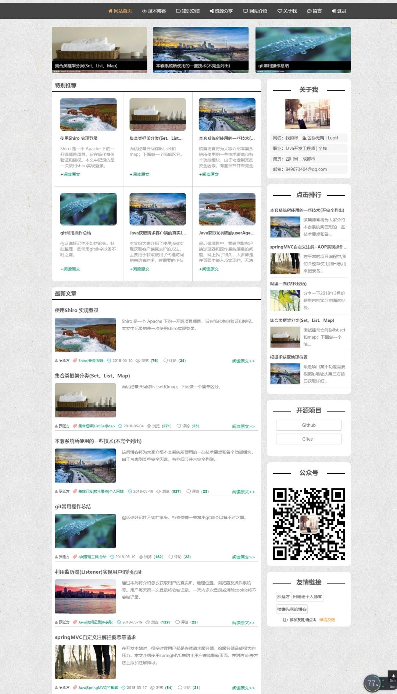
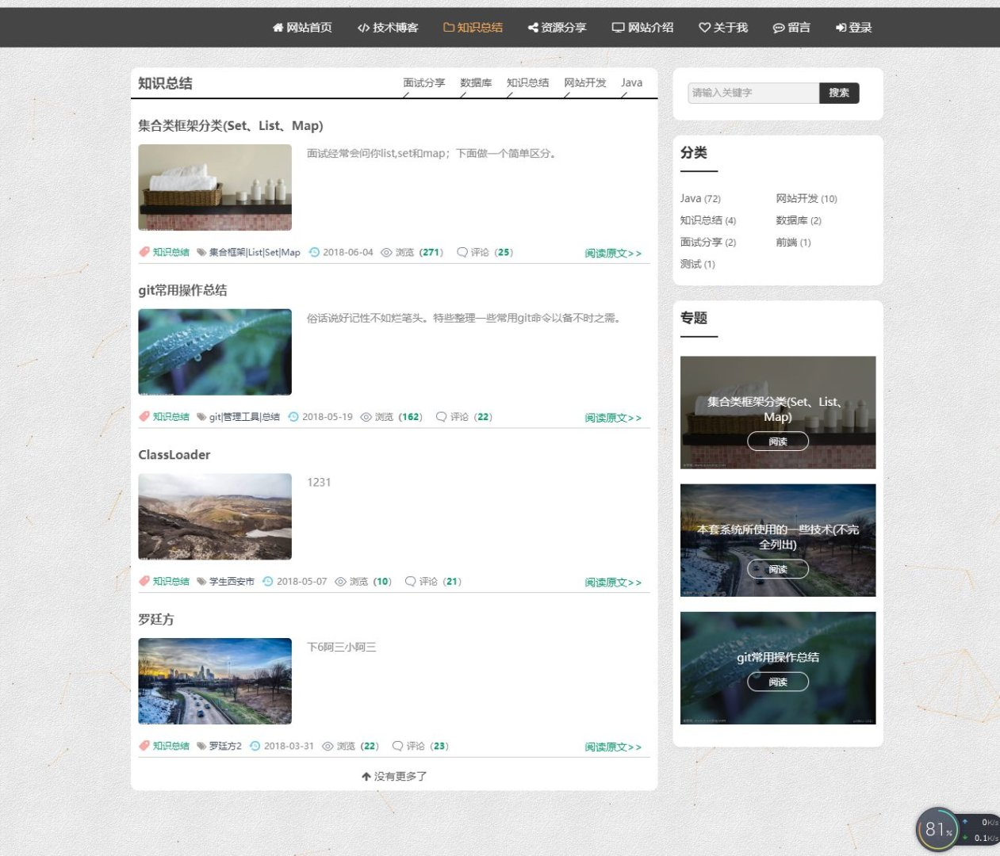
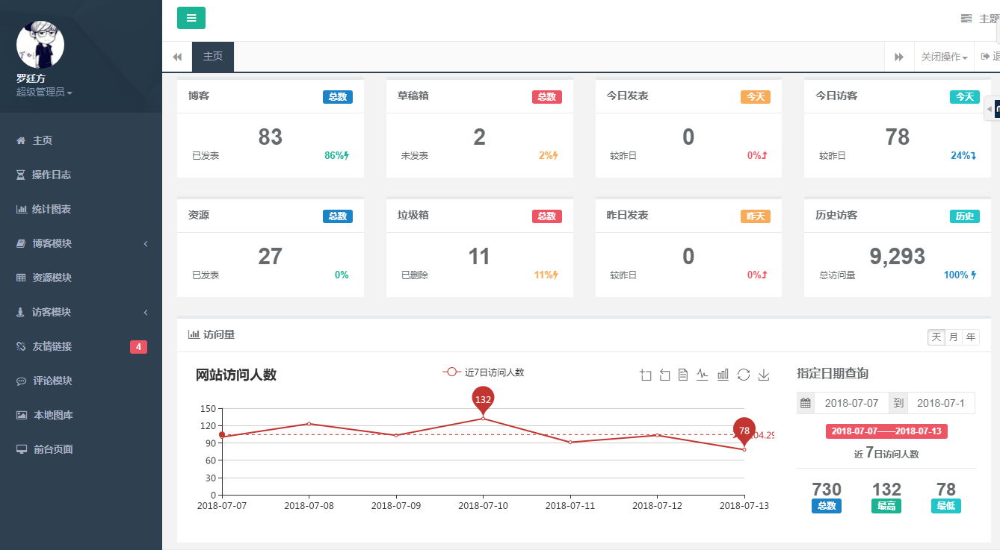
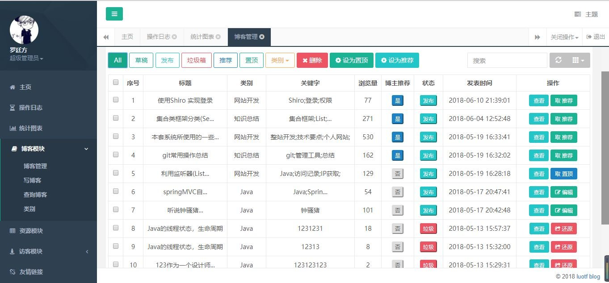
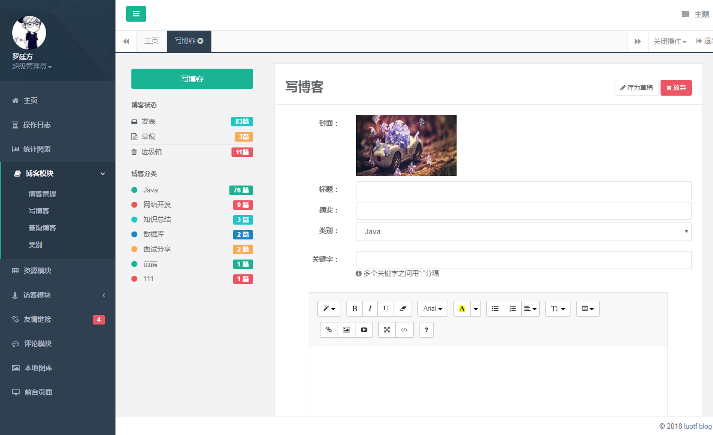
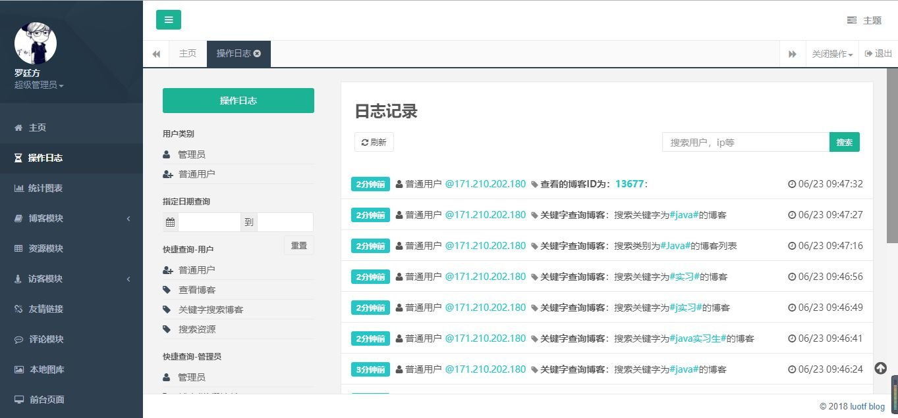
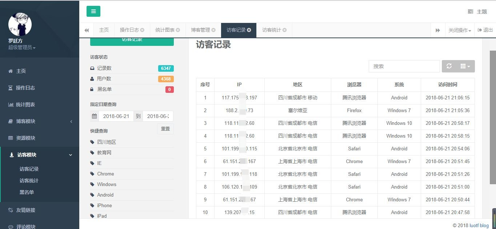

# Art_Blog
&emsp;&emsp;基于Spring+SpringMVC+Mybatis架构的开源博客：**博客管理**、**图表数据**、**日志分析**、**访问记录**、**图库管理**、**资源管理**、**友链通知**等。良好的页面预加载，无限滚动加载，文章置顶，博主推荐等。提供 **<font color=#FF6347 size=2 >用户端+管理端</font>** 的整套系统源码。**<font color=#FF6347 size=2 >响应式设计，支持手机、平板、PC，都有良好的视觉效果！</font>**

### 前言
> 大三学生，断断续续的三个月，终于完成了一个属于自己的作品。<br>
> 从需求分析，功能设计，前端到后台，再到数据库的设计。一点点的积累，一点点的完善。<br>
> 长达近一个月的测试，修复和优化。以用户的视角来设计这个作品的每一个细节。<br>
> 对一个开发人员来说，如果想单纯的做出这些功能，其实并不难。<br>
> 难的是对于这些功能细节的把控，项目整体的友好程度，用户的体验效果；对并发的考虑，对恶意请求，对流畅度这些细节的考虑等等。
> 在此期间，我参考了很多的优秀个人网站来丰富页面元素。<br>很多功能的解决方案都是根据自己的想法，可能并不是成熟稳定的方案。
> 但对于没有实际企业项目经验的我来说，能够解决实际问题，就已经进步了。<br>
> 需要添加友链的大佬，可以到 [**www.luotf.com**](http://www.luotf.com/) **<font color=#CD853F >首页右侧栏</font>** 申请添加。

### 重要通知
1. 目前已经开源，功能齐全、部署简单及完善的代码，一定会给使用者无与伦比的体验，如果觉得这个项目不错，请为它 **<font color=#FF6347 size=3 >点赞</font>** 支持。
2. 你可以拿它作为博客模板，因为 Art_Blog 界面美观，满足私人博客的一切要求。
3. Art_Blog 还有许多不完善的地方，鄙人才疏学浅，望见谅！

### 演示站点
[www.luotf.com](http://www.luotf.com/)   <br>
后台账号：luotf&nbsp;&nbsp;&nbsp;&nbsp;&nbsp;&nbsp;密码:admin

### 技术栈
#### 后端

名称 | 描述 | 官网
---|--- |---
Spring Framework | 容器	| http://projects.spring.io/spring-framework/
SpringMVC | MVC框架	| http://docs.spring.io/spring/docs/current/spring-framework-reference/htmlsingle/#mvc
MyBatis | ORM框架 |  	http://www.mybatis.org/mybatis-3/zh/index.html
MyBatis Generator | 代码生成 | http://www.mybatis.org/generator/index.html
Apache Shiro | 安全框架 | http://shiro.apache.org/
PageHelper | MyBatis分页 | http://git.oschina.net/free/Mybatis_PageHelper
Maven | 项目构建管理 | http://maven.apache.org/
MySQL | 数据库 | https://www.mysql.com/
Tomcat 8.0 | 服务器 | http://tomcat.apache.org/


#### 前端

名称 | 描述 | 官网
---|--- |---
jQuery | 函数库 | http://jquery.com/
Bootstrap | 前端框架 | 	http://getbootstrap.com/
Bootstrap-table | 数据表格 | http://bootstrap-table.wenzhixin.net.cn/
echarts | 图表 | http://echarts.baidu.com/
web uploader | 图片上传 | http://fex.baidu.com/webuploader/
layui | 弹出层 | http://www.layui.com/
sweetalert | 弹出层 |http://mishengqiang.com/sweetalert/
highlight | 代码高亮 |https://highlightjs.org/
summernote | 富文本编辑 |https://summernote.org/
pace | 进度条 |https://github.hubspot.com/pace/
datapicker | 时间选择器 | https://jqueryui.com/datepicker/
Font-awesome | 字体图标 | http://fontawesome.io/
fancybox | 图片展示 |http://fancybox.net/
fakeLoader | 页面预加载 |https://www.awesomes.cn/repo/joaopereirawd/fakeloader-js
content | 菜单栏 
contabs | 选项卡

### 界面预览
#### <font color=#1E90FF size=3 >[ 首页 ]</font> 显示 置顶的博客，特别推荐，点击排行，最新博客等，无限滚动加载。


#### <font color=#1E90FF size=3 >[ 列表页 ]</font> 显示某个类别的博客列表，关键字搜索，博客数量，专题等。


#### <font color=#1E90FF size=3 >[ 详情页 ]</font> 显示博客的具体内容，评论，推荐博客等。（截长屏 导致图片浮动元素 出现多次）
<html>
  
  
</html>
<br>

#### &emsp;&emsp;&emsp;&emsp;&emsp;&emsp;&emsp;移动端
<br><br><br><br><br><br><br>  <br><br><br>
<br><br><br><br><br><br><br>
<br><br><br><br><br><br>

---

#### <font color=#1E90FF size=3 >[ 后端首页 ]</font> 显示博客数，资源数，垃圾数，访客图表等。


#### <font color=#1E90FF size=3 >[ 博客管理 ]</font> 增/删/改/查博客，设置博客专栏等。


#### <font color=#1E90FF size=3 >[ 添加博客 ]</font> 封面图片可以直接选择服务器目录，也可以自己上传。富文本采用summernote，整合heightlight 实现代码高亮。提供发布前预览功能。


#### <font color=#1E90FF size=3 >[ 图表页 ]</font> 以图表的形式显示出博客的浏览量，网站访问量，发表量，日志数等。


#### <font color=#1E90FF size=3 >[ 操作日志 ]</font> 可以记录管理员的增删改查操作，可以记录下用户具体的查询内容等。


#### <font color=#1E90FF size=3 >[ 访问记录 ]</font> 获取用户的真实IP、地理位置、浏览器及操作系统等。 用户每天第一次登录将会被记录、一天内多次登录或清除cookie将不会被记录。


#### 其余界面访问 www.luotf.com 预览 &emsp;&emsp;后台:luotf/admin  
### 项目部署说明
> 1. 下载并导入本项目。
> 2. 在数据库中导入webapp文件下的 **blog.sql** ，赠送几千条数据。 (如果sql文件导入出错,请粘贴导入) 导入成功后将会多一个 **blog** 数据库。
> 3. 修改项目中的 **mysql.properties** 中的数据库信息。
> 4. 进入Tomcat 安装目录，找到**conf/server.xml** 在**Host**元素中添加子元素。 （重要）
> ```
> <Context path="/upload" docBase="C:\upload"/> 
> ```
> &emsp;这里采用虚拟目录映射，实现上传图片路径与项目路径分离。<br>
> &emsp;5. 然后通过Tomcat启动项目即可  http://localhost:8080/Blog <br>
> &emsp;6. 如果个别文件有报错，请直接无视。因版本和开发工具差异。
> 
#### 最新更新情况，[**请移至这里**](https://github.com/luotf/Art_Blog/tree/master)
### 开源赞助
&emsp;&emsp;如果你觉得 本系统不错，有用，对你的学习有帮助，以及作者的辛苦，请作者喝杯 咖啡吧。
#### <center><font color=#00BFFF size=3 >[ 欢迎 Star，Fork ]&emsp;&emsp;[ 欢迎提出问题，提出需求 ]&emsp;&emsp;[ 谢谢 ！]</font></center>
<html>
  <div align=left>支付宝|<!--在这里插入内容-->
</html>
<html>
  <center>微信</center>
  <!--在这里插入内容-->
</html>
